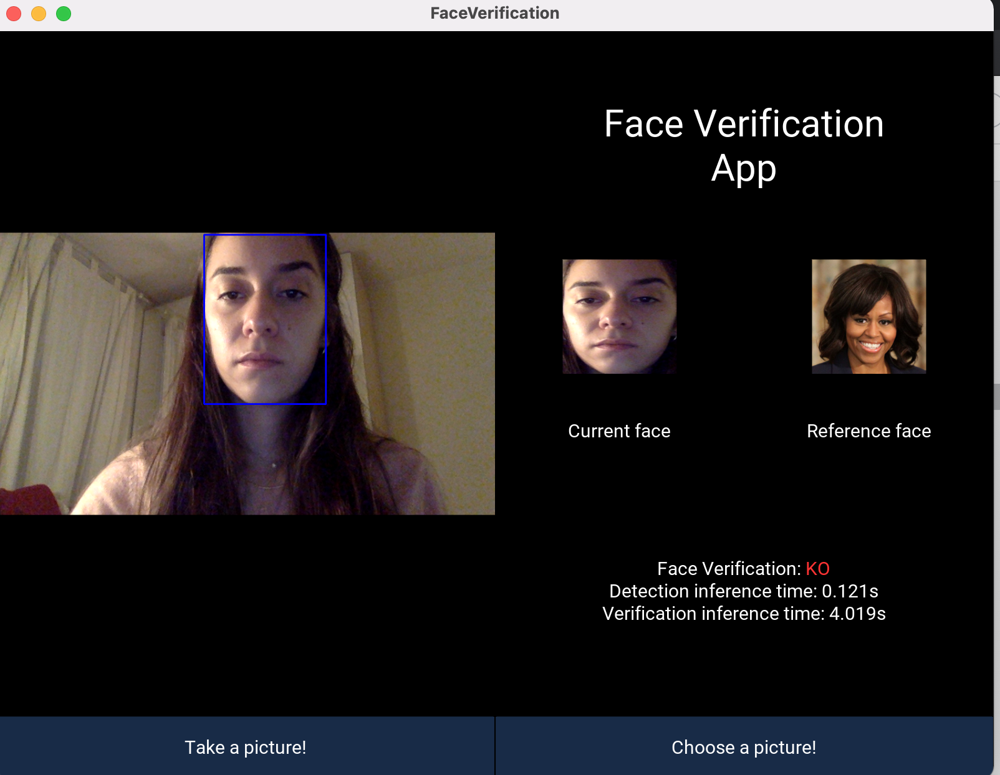
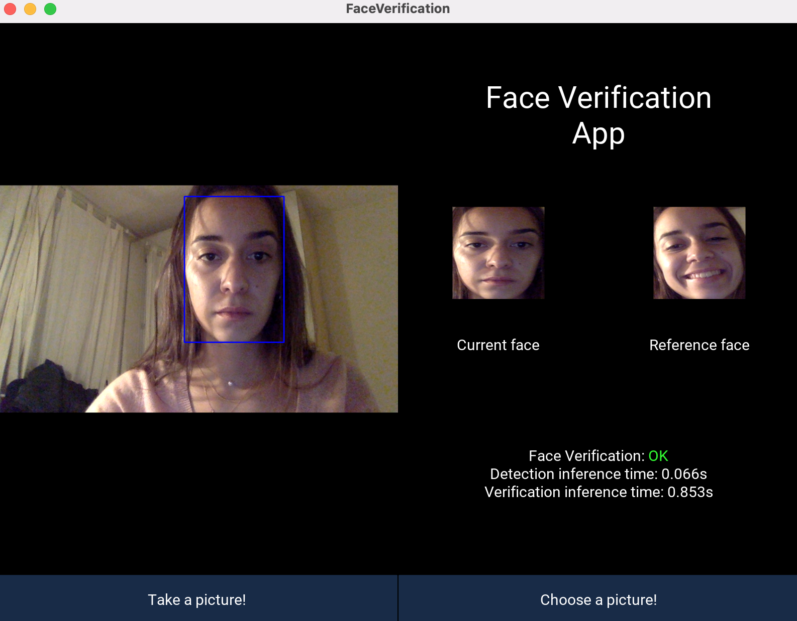

# face-verification
Face verification app for IMAGE DLIM course at EPITA by Clément Rebut, Matthew Rousseau and Sophie Starck.

This app detects a face on a videostream and uses uses pretrained weights from a siamese architecture to predict whether or not it is the same as a reference image. The reference image can be chosen from the computer filesystem or captured directly on the videostream.  
This type of software could be used for a face recognition problem, to unlock computers or phones for instance.

### Usage:
```
pip3 -r requirements.txt
python3 face_verification_app.py
```
### Examples:

<!--  -->




